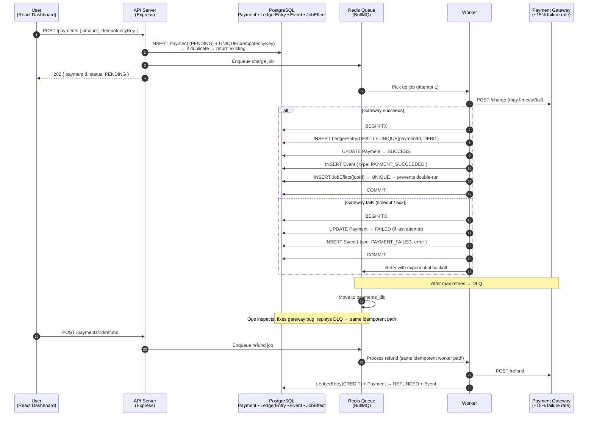

<div align="center">

# 💳 Payment System

**Async payment processing with ledger-based accounting, idempotency & at-most-once charges**

[](https://www.typescriptlang.org/)
[](https://nodejs.org/)
[](https://www.postgresql.org/)
[](https://redis.io/)
[](https://www.prisma.io/)
[](https://docs.bullmq.io/)
[](https://react.dev/)
[](https://www.docker.com/)

**[🚀 Live Demo](https://your-demo-url.com)** · **[⭐ Architecture](#-architecture)** · **[🛠️ Run Locally](#-running-locally)** · **[🧪 Tests](#-tests)**

</div>

---

> ⚠️ **Screenshots coming soon.** Replace this section with actual screenshots/GIFs of:
> - Payment dashboard showing list with status filters
> - Payment detail with ledger entries side-by-side
> - Refund button flow
>
> ```
> 
> 
> ```

---

## 🎯 What It Does

A full-stack **async payment processing engine** designed for real-world reliability: users submit payments through a React dashboard, the API enqueues the charge in Redis, and workers process it against a flaky payment gateway (intentional 10–20% simulated failure rate). The system guarantees no double-charges even when everything goes wrong:

- **Ledger-based accounting** — balances are derived, never written directly
- **Idempotency on both API and worker layers** — database-enforced
- **Retries + exponential backoff** — transient gateway timeouts don't drop charges
- **Dead-Letter Queue** — inspect and replay failed payments after bug fixes
- **Refund support** — refund also goes through the idempotent worker path
- **Full audit trail** — every state change recorded

### Why I Built This

Everyone "built a payment integration" with Stripe. Few build one that:
- Doesn't double-charge when the worker retries
- Handles "did the webhook fire twice or not?" correctly
- Proves correctness with tests for concurrency + duplicate webhooks
- Has a ledger that an accountant could actually audit

This project answers those questions.

---

## 🏗️ Architecture



### Key Architectural Decisions

| Decision | Why |
|----------|-----|
| **Ledger-first (double-entry)** | `balance` is never written. It's `SUM(credits) - SUM(debits)`. Impossible to "corrupt" a balance. |
| **Unique constraint on `(paymentId, type)` in LedgerEntry** | Worker retries can't write two DEBITs for the same payment — DB enforces it. |
| **`JobEffect(jobId)` UNIQUE** | Worker can run the same job ID twice but the side-effect transaction will roll back on the 2nd run. |
| **`Payment.idempotencyKey` UNIQUE** | Same POST from the client twice → same payment returned. No duplicate enqueues. |
| **Async everything (API never calls gateway directly)** | Gateway slowness/timeouts never block the HTTP thread. |
| **DLQ, not silent failure** | A failed charge in the DLQ has the full error + stack + attempt history. Replayable. |

---

## ✨ Core Features

### ✅ Ledger Accounting (The Real Deal)
Balances are **derived** from the ledger. You never `UPDATE users SET balance = balance - 10`. You `INSERT INTO ledger_entries (DEBIT, 10)`.
```sql
-- Current balance = sum of CREDITs − sum of DEBITs
```
This means:
- No race conditions can't break a balance (it's a SUM)
- Every change is an audit record
- Refunds are just another CREDIT row
- You can reconstruct any historical balance at any point in time

### ✅ Two-Layer Idempotency
1. **API layer** — duplicate `POST /payments` with the same `idempotencyKey` returns the existing `Payment` (unique constraint)
2. **Worker layer** — the same job retried 10 times writes the `LedgerEntry` at most once (unique constraint on `(paymentId, type)` + `JobEffect(jobId)`unique`)

No code logic tries real-world guarantees** — if the DB says it's correct, code can only be correct.

### ✅ Retry + DLQ
- Exponential backoff with jitter (BullMQ built-in)
- Max attempts configurable
- After max attempts → `payments_dlq` queue
- DLQ jobs are replayable with full context preserved
- Each attempt history stored on the payment (attempt #, error at, stack trace)

### ✅ Refund Flow
Refunds are not a "quick update" — they go through the **same idempotent worker pipeline**:
```
POST /payments/:id/refund → enqueue refund job → worker processes CREDIT ledger entry + Payment → REFUNDED status + Event + audit
```
Only `Payment must be in `SUCCESS` to refund (status transition enforced in DB TX.

### ✅ Full Audit Trail
Every relevant state change writes an `Event` row with JSON metadata:
```
PAYMENT_CREATED → { idempotencyKey, amount, source }
PAYMENT_SUCCEEDED → { gatewayTxnId, fee }
PAYMENT_FAILED → { attempt, error, stack }
PAYMENT_REFUNDED → { refundTxnId, reason }
```

### ✅ Dashboard (React + Vite)
- Filterable payment list (all / pending / success / failed / refunded)
- Payment detail view with side-by-side ledger entries
- "Refund" button (only enabled when status=SUCCESS)
- Real-time polling (async processing is not immediate; UI catches up)
- Clean, professional, shippable UI

---

## 🛠️ Tech Stack

| Layer | Technology |
|-------|-----------|
| **Frontend | React 18 · Vite · TypeScript |
| **API** | Node.js · Express · Zod validation |
| **Queue & Workers** | Redis 7 · BullMQ (retries, rate limit, concurrency) |
| **Database** | PostgreSQL 15 · Prisma ORM |
| **Payment Gateway** | Fake/stub gateway with configurable failure rate |
| **Tests** | Vitest · Supertest · 2 concurrent workers in test harness |
| **Infra** | Docker Compose (Postgres + Redis) |

---

## 🚀 Live Demo

> ⚠️ **Deploy first, then fill this in.**
>
> | Resource | URL |
> |----------|-----|
> | Dashboard | `https://your-payments-demo.com` |
> | API Base | `https://your-payments-demo.com/api` |
> | Demo user login | `demo@example.com` / `demo1234` |

---

## ⚙️ Running Locally

### Prerequisites
- Node.js 18+
- Docker Desktop

### 1. Infrastructure (Postgres + Redis)
```bash
docker compose up -d
```
Ports (override in `.env`):
- Postgres: `5432`
- Redis: `6379`

### 2. Backend (API + Worker)
```bash
npm install
copy .env.example .env
npm run prisma:migrate
```

Terminal 1 — API:
```bash
npm run dev
# API at http://localhost:3000
```

Terminal 2 — Worker:
```bash
npm run dev:worker
```

### 3. Frontend Dashboard
```bash
npm --prefix web install
npm run dev:web
# Dashboard at http://localhost:5173
```
The Vite dev server proxies `/api` to `http://localhost:3000`.

---

## 📘 API Reference

### Create Payment
```http
POST /payments
Content-Type: application/json

{
  "userId": "uuid-of-user",
  "amount": 10000,
  "idempotencyKey": "order-abc123-charge-1"
}
```
- Same `idempotencyKey` twice → returns the same `Payment` (no duplicate)
- Returns **202 Accepted** with `{ id, status: "PENDING" }`

### List Payments
```http
GET /payments?status=SUCCESS,FAILED
```

### Get Payment + Ledger
```http
GET /payments/:id
```
Returns the payment object + nested `ledgerEntries[]`.

### Refund Payment
```http
POST /payments/:id/refund
Content-Type: application/json

{ "reason": "Customer request" }
```
- Only works if `status === "SUCCESS"`
- Enqueues a refund job; same idempotent worker path

---

## 🧪 Tests

Run the full integration suite (requires Docker up):
```bash
npm test
```

### Test Coverage — The Hard Stuff

| Test Scenario | What It Proves |
|---------------|---------------|
| ✅ Happy path charge → SUCCESS | Basic flow works |
| ✅ Fail 3 times → retry → SUCCESS | Retry + backoff recover correctly |
| ✅ Fail all attempts → DLQ | No silent drops |
| ✅ Same `idempotencyKey` × 2 parallel POSTs | 1 payment only; 0 duplicates |
| ✅ **2 concurrent workers** processing same job ID | **Exactly 1 LedgerEntry (DEBIT)** → constraint enforces at-most-once |
| ✅ Refund after SUCCESS | CREDIT ledger + REFUNDED status |
| ✅ Refund while PENDING → rejected | State machine enforced |
| ✅ Refund idempotency → duplicate refund job × 2 workers | Exactly 1 CREDIT |
| ✅ Correlation IDs in logs | `requestId`, `paymentId`, `jobId`, `attempt` all present |

> 💡 The concurrency tests are the most important part of this portfolio. They spin up 2 worker instances and verify the DB-unique constraints actually work — this is what fails silently in 90% of "payment tutorials.

---

## 🚢 Deployment

### Recommended: Two Services (Same Repo)
Deploy as two separate services (same code, different start commands):

| Service | Command | Purpose |
|---------|---------|---------|
| **API** | `npm run deploy:api` | HTTP traffic; never calls gateway |
| **Worker** | `npm run deploy:worker` | Background queue consumer; no port needed |

Both need:
- `DATABASE_URL` → managed Postgres
- `REDIS_URL` → managed Redis

### Platforms
- **Render**: two services + Blueprint (use `render.yaml` if your repo has one)
- **Railway**: two services pointing at same repo, different start cmd
- **Fly.io**: two apps, shared volumes optional
- **AWS**: ECS Fargate → two task definitions

---

## 📊 Data Model

```
Payment
  id              uuid PK
  userId          uuid FK→User
  idempotencyKey  text UNIQUE          ← API idempotency
  amount          int (cents)
  status          PENDING | SUCCESS | FAILED | REFUNDED
  attempts        int
  lastError       text
  gatewayTxnId    text (nullable)
  timestamps

LedgerEntry
  id              uuid PK
  userId          uuid FK→User
  paymentId       uuid FK→Payment
  type            DEBIT | CREDIT        ← UNIQUE(paymentId, type)
  amount          int
  UNIQUE(paymentId, type)            ← Worker idempotency — no double ledger

Event
  id              uuid PK
  paymentId       uuid FK→Payment
  type            PAYMENT_CREATED / SUCCEEDED / FAILED / REFUNDED
  metadata        jsonb
  createdAt

JobEffect
  jobId           text UNIQUE        ← Worker idempotency — same job twice → 2nd TX rollback
  ranAt           timestamp
```

---

## 🧠 Lessons from Building This

1. **Never `UPDATE balance` in a payment system.** Ever. `INSERT` a ledger row. Your balance is a query, not a column.
2. **Idempotency must be enforced by the database, not checked in code.** Code has race conditions — `UNIQUE` constraints don't.
3. **The worker will retry. Plan for it.** Any side-effect that isn't idempotent **will** run twice under failure.
4. **Failures aren't exceptional; they're expected.** The DLQ is not a "nice to have" — it's how you keep your business.
5. **Logs without correlation IDs are useless.** You need `requestId → paymentId → jobId → attempt` to debug "why did this charge fail on attempt #4?".

---

<div align="center">

**[⬆ Back to Top](#-payment-system)** · Engineered for correctness under failure.

</div>
